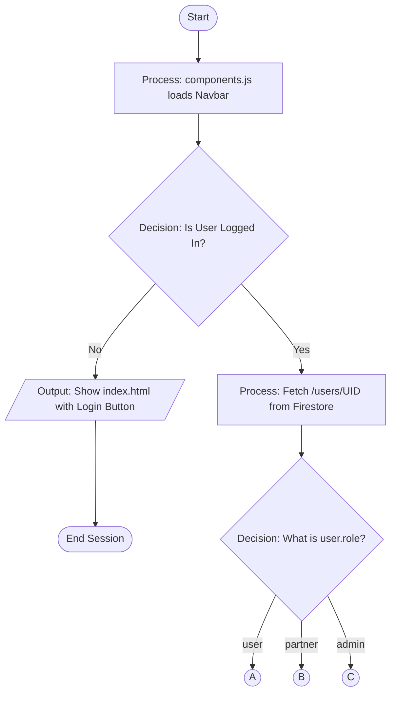
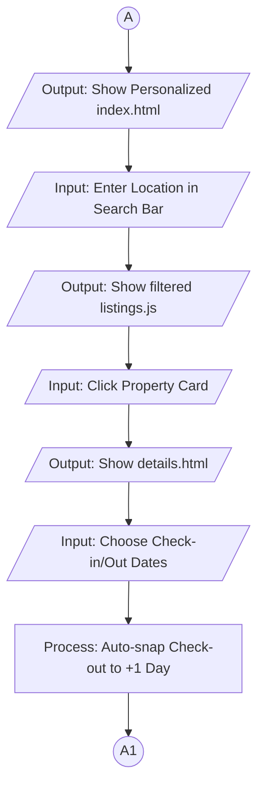
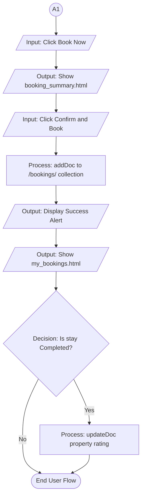
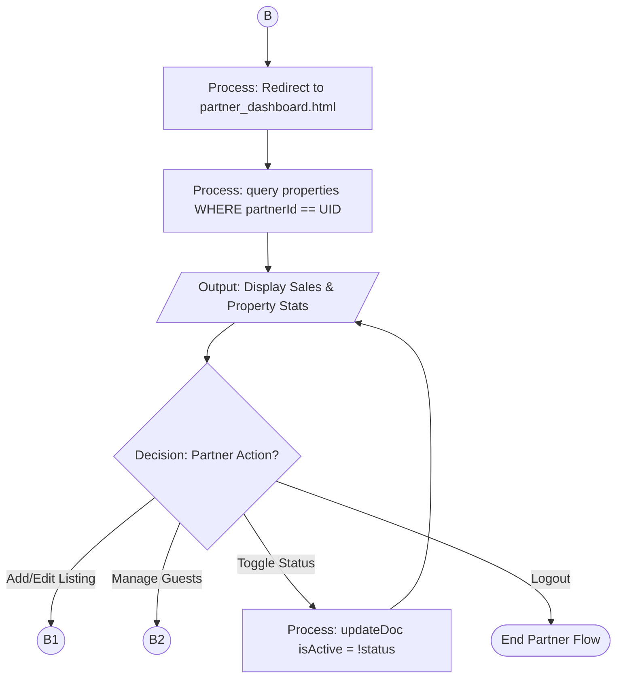
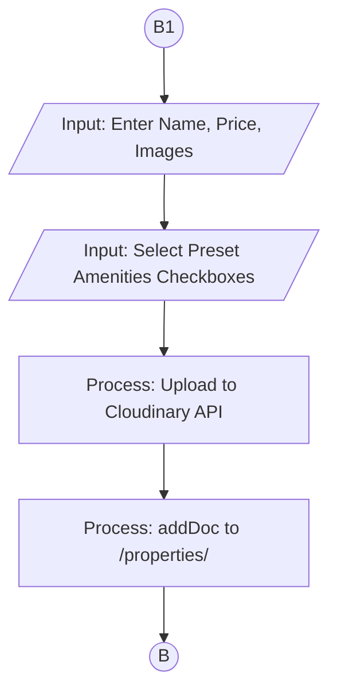
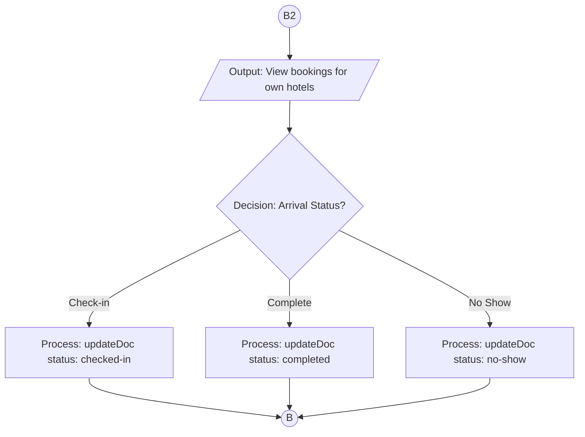
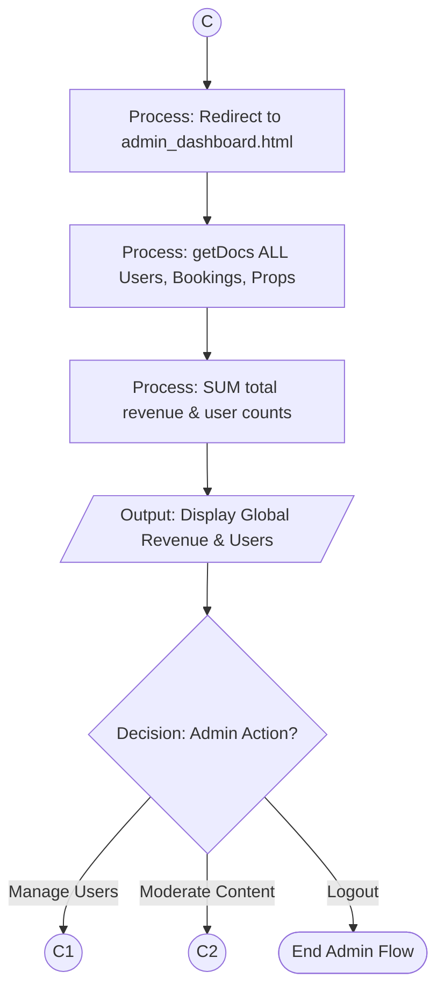
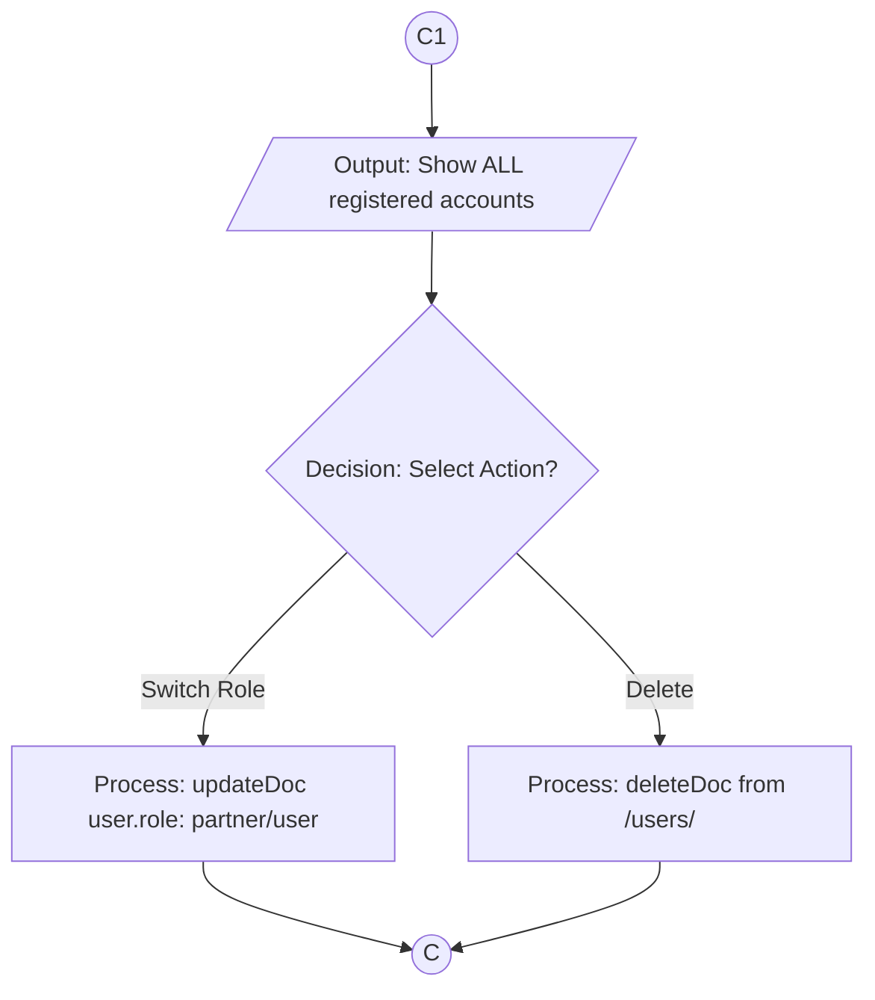
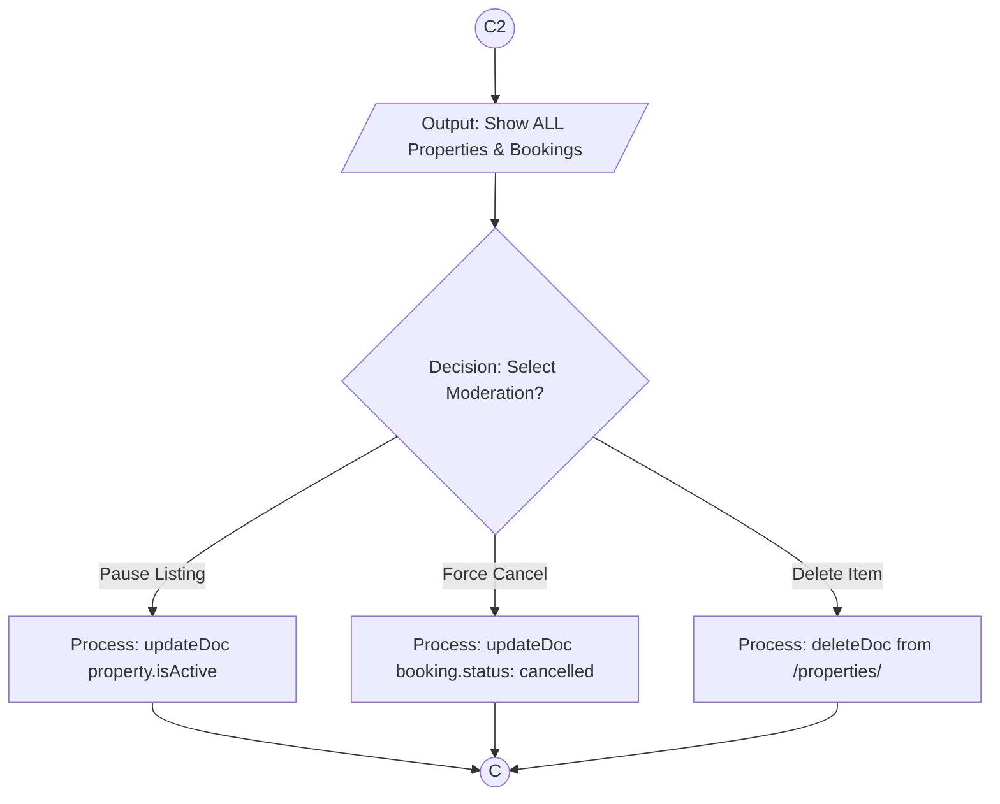

# RedDoorz Cebu: Academic Program Flowcharts

This document provides separate, pure flowcharts for each role in the system. These follow the strict **Academic Tradition** using standard symbols:
- **Stadium `([ ])`**: Start and End points.
- **Rectangle `[ ]`**: Internal Processes (Code execution).
- **Diamond `{ }`**: Decisions (Conditional logic).
- **Parallelogram `[/ /]`**: Input/Output (User interaction & Screen display).

---

## 1. System Initialization & Auth Gate
How the program starts and identifies the user role.

---

## 2. Role: Customer (User) Workflow

### 2.1 Sub-Flow: Search & Property Selection
Logic for finding and selecting a hotel in Cebu.

### 2.2 Sub-Flow: Checkout & Post-Stay Review
Logic for finalizing the booking and sharing feedback.

---

## 3. Role: Property Owner (Partner) Workflow

### 3.1 Partner Main Hub
The entry point and primary decision tree for property owners.

### 3.2 Sub-Flow: Property Listing (B1)
Handles listing creation and image processing.

### 3.3 Sub-Flow: Booking Management (B2)
Handles guest arrivals and status updates.

---

## 4. Role: Platform Manager (Admin) Workflow

### 4.1 Admin Main Hub
Global oversight of system performance and platform health.

### 4.2 Sub-Flow: User Moderation (C1)
Logic for managing user accounts and access roles.

### 4.3 Sub-Flow: Platform Control (C2)
Logic for moderating listings and system-wide transactions.

